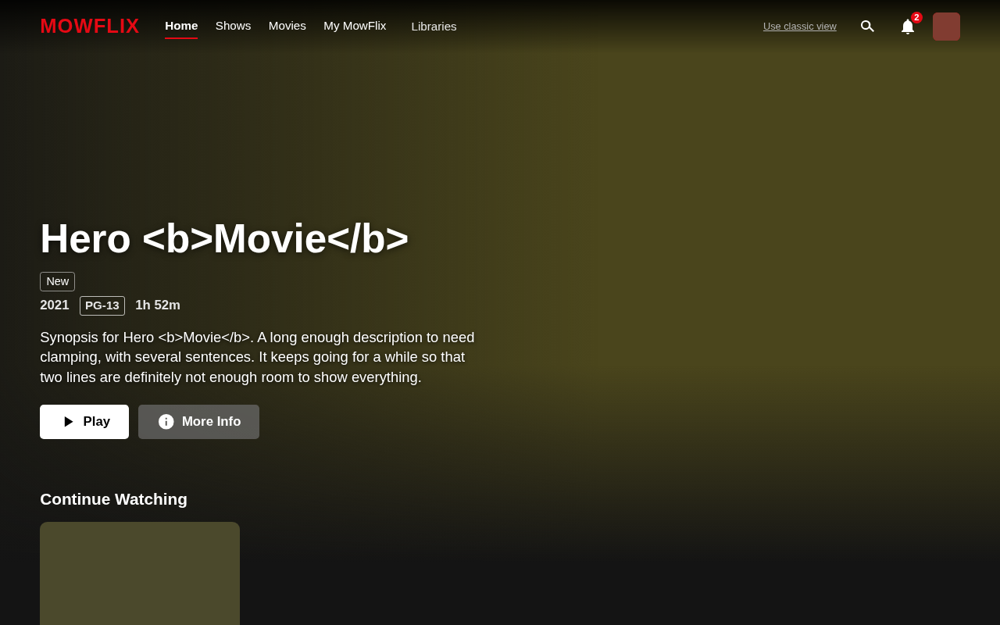
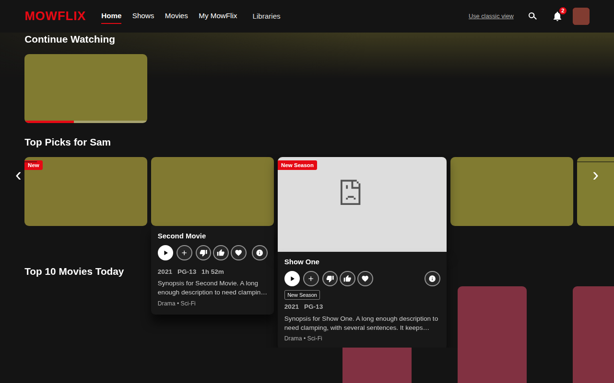

# FullUI

A streaming-style interface for your own Jellyfin server. FullUI replaces Jellyfin's home page with a personal screen: a big picture with a trailer, rows made for each person ("Top Picks for You", "Because you watched ...", Top 10, Continue Watching), a Coming Soon list with "I want this" requests, a "Match %" and a one-line reason on each title, optional AI search that understands what you mean, and skip-intro and next-episode buttons on the player. Everything runs on **your** server, and your viewing history stays on it (trailers are the one exception: they play from YouTube in the viewer's browser, and an admin can switch them off).





## What you get

- A personal **Home**, **Shows**, **Movies** and **My (server name)** tab, search, notification bell and a "Use classic view" escape hatch back to normal Jellyfin.
- Rows chosen per person from what they watch, rate and add to My List, with the reason shown (see the [user guide](docs/USER_GUIDE.md)).
- **Coming Soon** and requests ("I want this"), with an admin page showing the Most Requested titles.
- An admin **Health** page that says in plain English whether everything works, plus backup/export of FullUI's data.
- Optional AI search using Ollama on your own computer (off by default; read the warning in the [admin guide](docs/ADMIN_GUIDE.md) first).
- Skip intro / recap / credits and next-episode countdown drawn on top of Jellyfin's player (it never replaces the player).

## Works with

- **Jellyfin 10.11.6 and later** (the 10.11 line). Not 10.10, not 10.12, not 10.11.0 to 10.11.5.
- **Server:** Windows 10/11, Linux or macOS, no Docker needed. The installer needs PowerShell or Python 3.
- **Where you see FullUI:** Jellyfin in a web browser, the Jellyfin phone/tablet apps that wrap the web page, and LG/Samsung TVs running the Jellyfin web app.
- **Where you do not:** the official Android TV / Fire TV app and Swiftfin show Jellyfin's own screen (FullUI can write optional "FullUI:" playlists for them).
- **Fire TV:** a separate Fire TV app lives in `firetv/`, but it is **paused and experimental**. Do not rely on it.
- FullUI also needs the free third-party **File Transformation** plugin (the installer adds it).

## Get started

1. Run the one-file installer. Windows: download `FullUI-Installer.cmd` from the [latest release](https://github.com/Narsmow/FullUISuit/releases/latest) and double-click it. Linux/macOS: download `FullUI-Installer.sh` and run `bash FullUI-Installer.sh`.
2. Answer the questions (admin sign-in, optional TMDB key, optional Ollama). It restarts Jellyfin and checks that it worked.
3. Press Ctrl+F5 in your browser.

| Read this | If you want to |
|---|---|
| [docs/INSTALL.md](docs/INSTALL.md) | Install, update, uninstall, sideload the Fire TV app, fix installer problems |
| [docs/USER_GUIDE.md](docs/USER_GUIDE.md) | Understand the screens, thumbs, My List, Coming Soon, search and privacy |
| [docs/ADMIN_GUIDE.md](docs/ADMIN_GUIDE.md) | Set up TMDB and Ollama, use the Requests and Health pages, back up, add kids, troubleshoot |

Manual plugin repository URL (Dashboard > Plugins > Repositories):
`https://raw.githubusercontent.com/Narsmow/FullUISuit/main/manifest.json`

## Data and attributions

- FullUI stores its own small data files in your Jellyfin data folder (`fullui/`). Other users never see your ratings, My List or votes; see the privacy section of the user guide.
- Trailers play from YouTube in the viewer's browser. Admins can switch them off in the FullUI settings.
- Coming Soon, requests and some trailers use TMDB. **This product uses the TMDB API but is not endorsed or certified by TMDB.**
- The Fire TV app is a fork of the open-source Wholphin client (GPL-2.0); see `firetv/FULLUI_NOTICE.md`.

---

# For developers

## Layout

- `server/Jellyfin.Plugin.FullUI/` C# Jellyfin plugin: settings, Health and Requests pages (`Configuration/*.html`), REST API under `/FullUI/*` (`Api/`), recommendation engine (`Recs/`), library snapshot (`Library/`), Coming Soon, requests, reminders, onboarding, New & Popular (`Discovery/`), usage events (`Metrics/`), health, backup/purge (`Ops/`), AI (`Ai/`), scheduled tasks (`Tasks/`), web injection through File Transformation (`WebInjection*.cs`).
- `server/Jellyfin.Plugin.FullUI.Tests`, `.DiscoveryTests`, `.ApiTests` xUnit projects (engine and household simulator, TMDB/requests/reminders, DI wiring, JSON casing, authorization, store).
- `web/` TypeScript bundle injected into jellyfin-web (Vite, vitest, Playwright end-to-end tests against a mock server).
- `installer/` the one-file installer (`install.ps1`, `fullui_install.py`, `install.sh`, `Install-FullUI.cmd`), its mock Jellyfin and tests, and release tooling.
- `firetv/` Wholphin fork for Fire TV (paused).
- `tools/abi-matrix.sh` + `tools/abicheck/` proves the built plugin only uses Jellyfin APIs that exist unchanged in every supported server version.
- `docs/` guides, `api-contract.md` (the API between server and clients), `BUGS.md` (the ranked bug list and what still needs a real server).
- `.claude/skills/` project skills for Claude Code agents (see below).

## Build and test

```bash
# Web bundle
cd web && npm ci && npm run typecheck && npm test && npm run build
npm run e2e                      # builds, then Playwright end-to-end tests

# Server (the plugin targets net9.0; the .NET 10 SDK builds it)
cp web/dist/* server/Jellyfin.Plugin.FullUI/Web/   # embed the bundle (build web first)
dotnet build -c Release server/Jellyfin.Plugin.FullUI
dotnet test server/Jellyfin.Plugin.FullUI.Tests -c Release
dotnet test server/Jellyfin.Plugin.FullUI.DiscoveryTests -c Release
dotnet test server/Jellyfin.Plugin.FullUI.ApiTests -c Release

# Installer (mock Jellyfin, Linux; CI also runs Windows PowerShell 5.1 and 7)
bash installer/tests/run-tests.sh

# Supported-version check: needs network access to NuGet; must report 0 problems for 10.11.6 .. latest 10.11.x
tools/abi-matrix.sh
```

Manual dev install: install File Transformation on Jellyfin, build as above, copy `Jellyfin.Plugin.FullUI.dll` into `<jellyfin data>/plugins/FullUI/`, restart, then Dashboard > Plugins > FullUI.

## Conventions

- The API shape is in `docs/api-contract.md`; web mocks and types come from the committed `docs/contract-fixtures/*.json` (real serialized server responses), never hand-written.
- Every action returns through `SafeApi.Json` (camelCase), per-user routes take the user from the sign-in token only, admin routes use `RequiresElevation`.
- Jellyfin API calls that differ between 10.11.6 and later versions go through `Compat/` and are verified with `tools/abi-matrix.sh`.
- The wording of public text avoids trademarks of other streaming services; say "a streaming-style interface".
- Releases: pushing a `v*` tag runs `.github/workflows/release.yml` (tests first, then plugin zip, manifest, installers).

## Working with agents

The project was built with a review, rank, fix, verify loop. Read the skills before changing things:

- `.claude/skills/review-fix-loop` independent read-only reviewers, consolidated `docs/BUGS.md`, parallel fix agents in worktrees, merge and re-verify.
- `.claude/skills/jellyfin-plugin-dev` plugin layout, routes, build, installing on a real server.
- `.claude/skills/jellyfin-version-compat` keeping the plugin working on every supported Jellyfin (ABI matrix).
- `.claude/skills/netflix-ui-spec` the interface spec shared by web and Fire TV (the folder name is historical).
- `.claude/skills/web-e2e-testing` and `.claude/skills/installer-safety` for those areas.

What cannot be proven without a real Jellyfin, Windows PC or device is listed at the top of `docs/BUGS.md`.
